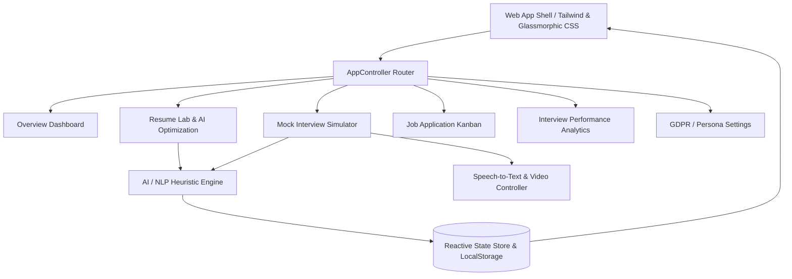

<div align="center">

# 🚀 CareerAI — AI-Powered Resume & Interview Coach
### *Intelligent Career-Preparation Platform (PCE SW PS 9 • Version 2.0)*

[](https://github.com/aaaaasadi/SIH.git)
[](https://sih-bmdt.onrender.com)
[](https://opensource.org/licenses/MIT)
[](https://developer.mozilla.org/en-US/docs/Web/JavaScript)
[](https://developer.mozilla.org/en-US/docs/Web/HTML)
[](https://developer.mozilla.org/en-US/docs/Web/CSS)

[Live Overview](#-executive-summary) • [Core Features](#-key-modules--capabilities) • [System Architecture](#-system-architecture) • [MoSCoW Matrix](#-moscow-requirements-traceability) • [Quick Start](#-quick-start--local-deployment)

</div>

---

## 📌 Executive Summary

The **AI-Powered Resume & Interview Coach (CareerAI)** is an enterprise-grade career preparation platform designed to help job seekers craft ATS-optimized resumes and practice role-tailored mock interviews with one unified AI coach.

By unifying resume optimization and interview coaching around a shared **Target Job Description (JD)** in a single closed loop, CareerAI eliminates the guesswork of job hunting with actionable, NLP-driven feedback.

---

## 🎯 Unified AI Coach

CareerAI operates as one intelligent interview and coaching system for every user. It combines resume review, target-role matching, mock interview practice, and coaching feedback under a single adaptive AI experience without persona switching.

---

## 🌟 Key Modules & Capabilities

### 1. 📊 Overview & Dashboard
- **Welcome Hero Card**: Dynamic greeting, summary recommendations, and radial **Resume Strength Gauge** ($94\%$).
- **Metric Trio**: Real-time status indicators for **ATS Compatibility** (*High • 94%*), **Keyword Alignment** ($90\%$), and **Interview Readiness** (*88%*).
- **Interactive Keyword Match**: Instant visualization of keywords found in resume vs. recommended additions with **1-click "+ Add" to Skills**.
- **Interview Prep Quick Launch**: Next scheduled mock session with recent AI coach feedback highlights.
- **ATS Critical Issues Alert**: Immediate banner flagging formatting inconsistencies.

### 2. 📝 Resume Lab & AI Optimization Drawer
- **Dual-Pane Interactive Editor**: Full WYSIWYG formatted document canvas with formatting toolbar (Bold, Italic, Underline, Bullet Lists, Version History).
- **Target Role Match Gauge**: Radial score ($75\%$) measuring alignment with active Job Description.
- **Actionable Suggestions & 1-Click AI Rewrites**: Instant conversion of weak bullets into quantified, high-impact STAR achievements (*Quantify Impact*, *Stronger Action Verbs*).
- **Keyword Gap Extraction**: Automatic scanning for missing high-impact technical and domain skills.
- **Bulk AI Enhancer**: 1-click `✦ Optimize with AI` button.
- **Export Engine**: Clean, printable ATS-compatible PDF and DOCX/Markdown export.

### 3. 🎙️ Live Mock Interview Simulator & AI Coach Room
- **Live Video Window**: WebCam integration (`getUserMedia`) and high-fidelity video stream with **Auto-Framing**, **Lighting Enhancement**, and **Virtual Studio Background**.
- **Speech-to-Text Transcription**: Real-time voice transcription via Web Speech API with live cursor streaming and manual edit fallback.
- **Live AI Coach Real-Time Analysis**: Active detection of **STAR structure** (*Situation* ✔, *Task* ✔, *Action* ✔, *Result* ✘) and live pacing warnings (*Slightly Rushed*).
- **Dynamic Waveform Visualizer**: Live audio bar frequency animation.
- **Post-Session Evaluation Report (PRD 12.2)**: Overall score ($78/100$), STAR breakdown checklist, filler-word counts (*"um"*, *"like"*), pacing metrics (WPM), actionable coaching tips, and **Retry Question** comparison.

### 4. 📈 Interview Performance & Coaching Analytics
- **Readiness Score Metric**: Radial score ($82\%$, *Top 15%*, $+12\%$ growth trend over last 5 sessions).
- **Skill Breakdown Meters**: Progress metrics across *Behavioral* ($88\%$), *Technical Communication* ($75\%$), and *Confidence & Tone* ($62\%$).
- **AI Coach Insights**: Highlighted Strengths and Areas for Growth.
- **Recent Sessions Log**: Chronological history of past mock interviews with score pills and detail view.

### 5. 🗂️ Job Application Kanban Tracker
- **4-Stage Pipeline**: *Wishlist*, *Applied*, *Interviewing*, *Offer*.
- **Rich Company Cards**: Priority badges (*High Priority*, *Medium*, *Referral*), interview countdowns, and stage progress bars.
- **1-Click Contextual Actions**: `[ Tailor Resume ]` and `[ Mock Prep ]` buttons on cards that instantly target Resume Lab and Mock Interview rooms for that specific company.

### 6. 🛡️ GDPR / CCPA Compliance & Privacy Center
- **Data Subject Access Request (DSAR)**: Full JSON export of user resumes, mock transcripts, and scores.
- **Right to Erasure**: 1-click permanent data purge.
- **Granular Consent Management**: Toggles for voice data retention and longitudinal AI coaching analytics.

---

## 🏗️ System Architecture



---

## 📋 MoSCoW Requirements Traceability

| ID | Requirement | PRD Priority | Implementation Status |
| :--- | :--- | :--- | :--- |
| **FR-1.1** | Upload resumes (PDF/DOCX/Text) | Must-have | ✅ Implemented |
| **FR-1.2** | Parse resume into structured sections | Must-have | ✅ Implemented |
| **FR-1.3** | Accept job description for comparison | Must-have | ✅ Implemented |
| **FR-1.4** | Generate resume-to-JD match score (0–100) | Must-have | ✅ Implemented |
| **FR-1.5** | Highlight missing keywords & skills | Must-have | ✅ Implemented |
| **FR-1.6** | AI-rewritten bullets with action verbs & metrics | Should-have | ✅ Implemented |
| **FR-1.7** | Flag ATS-incompatible formatting | Should-have | ✅ Implemented |
| **FR-1.8** | Export optimized resume as PDF/DOCX | Must-have | ✅ Implemented |
| **FR-2.1** | Generate role-specific & behavioral questions | Must-have | ✅ Implemented |
| **FR-2.2** | Support typed and voice-recorded responses | Should-have | ✅ Implemented |
| **FR-2.3** | Transcribe voice responses via speech-to-text | Should-have | ✅ Implemented |
| **FR-2.4** | Evaluate answers for STAR structure & clarity | Must-have | ✅ Implemented |
| **FR-2.5** | Detect filler words & pacing issues | Could-have | ✅ Implemented |
| **FR-2.6** | Structured feedback report with score & tips | Must-have | ✅ Implemented |
| **FR-2.7** | Retry question and compare scores across attempts | Should-have | ✅ Implemented |
| **FR-3.1** | Store historical resume & interview scores | Must-have | ✅ Implemented |
| **FR-3.2** | Display progress trends & skill breakdown | Should-have | ✅ Implemented |
| **FR-4.1** | Unified interview and coaching experience | Must-have | ✅ Implemented |
| **FR-4.2** | GDPR/CCPA data export and deletion | Must-have | ✅ Implemented |

---

## 💻 Quick Start & Local Deployment

### Prerequisites
- Any modern web browser (*Chrome, Edge, Firefox, Safari*).
- Python 3.x for running local HTTP server.

### Running Locally
1. Start the zero-dependency Python server:
   ```bash
   python server.py
   ```
2. Open your browser and navigate to:
   ```text
   http://localhost:8080
   ```
3. Or open `index.html` directly in your browser.

---

## 📜 License
This project is open-source under the [MIT License](LICENSE).
